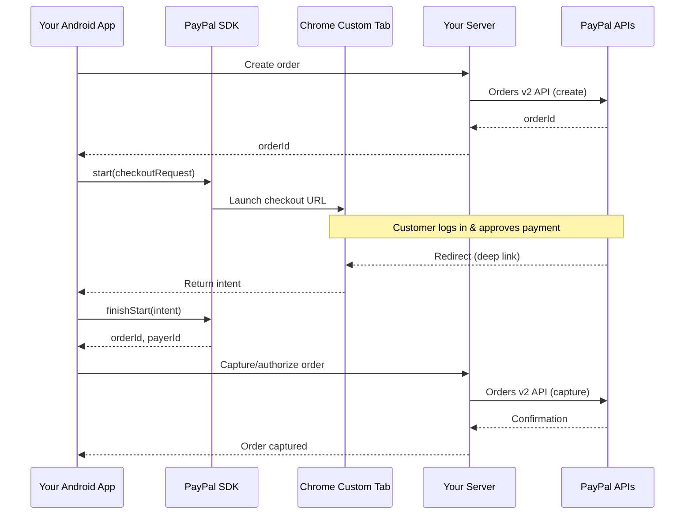
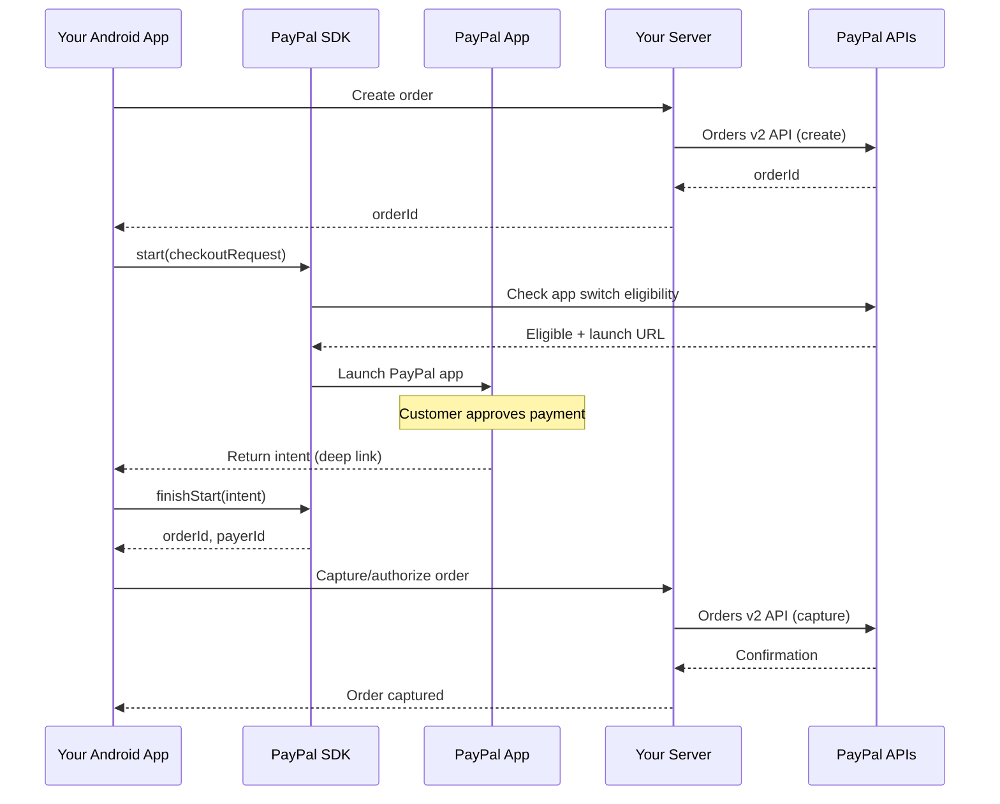
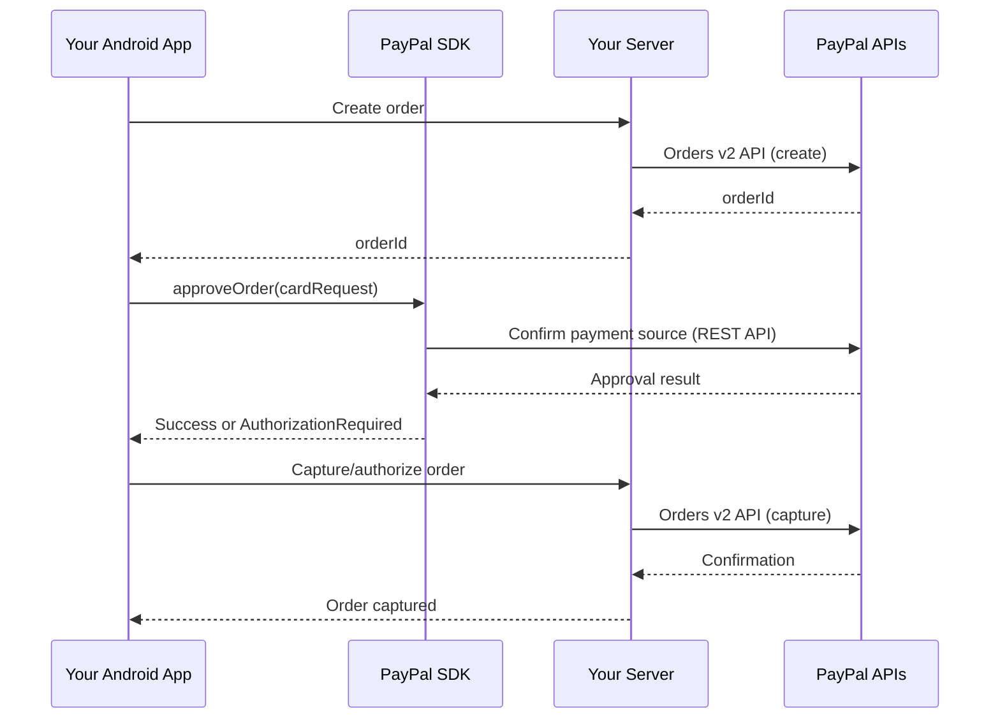
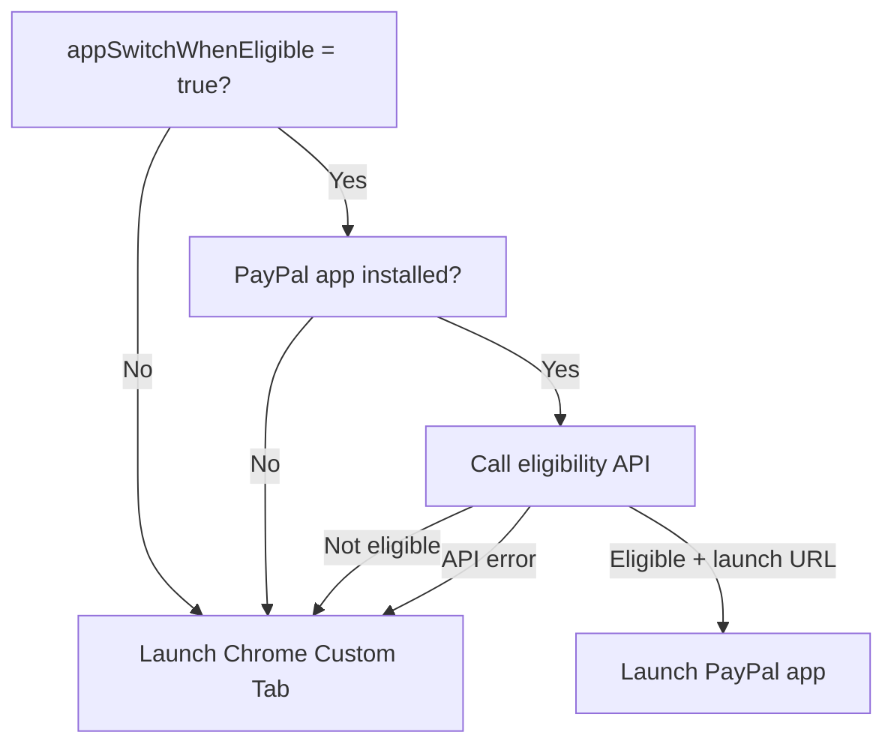
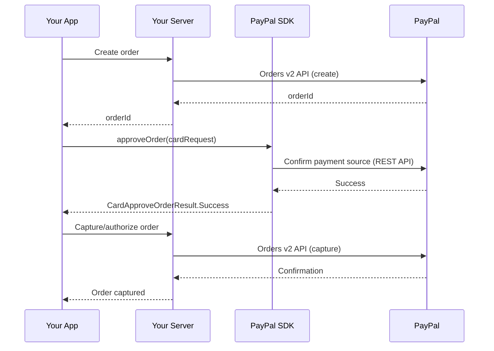
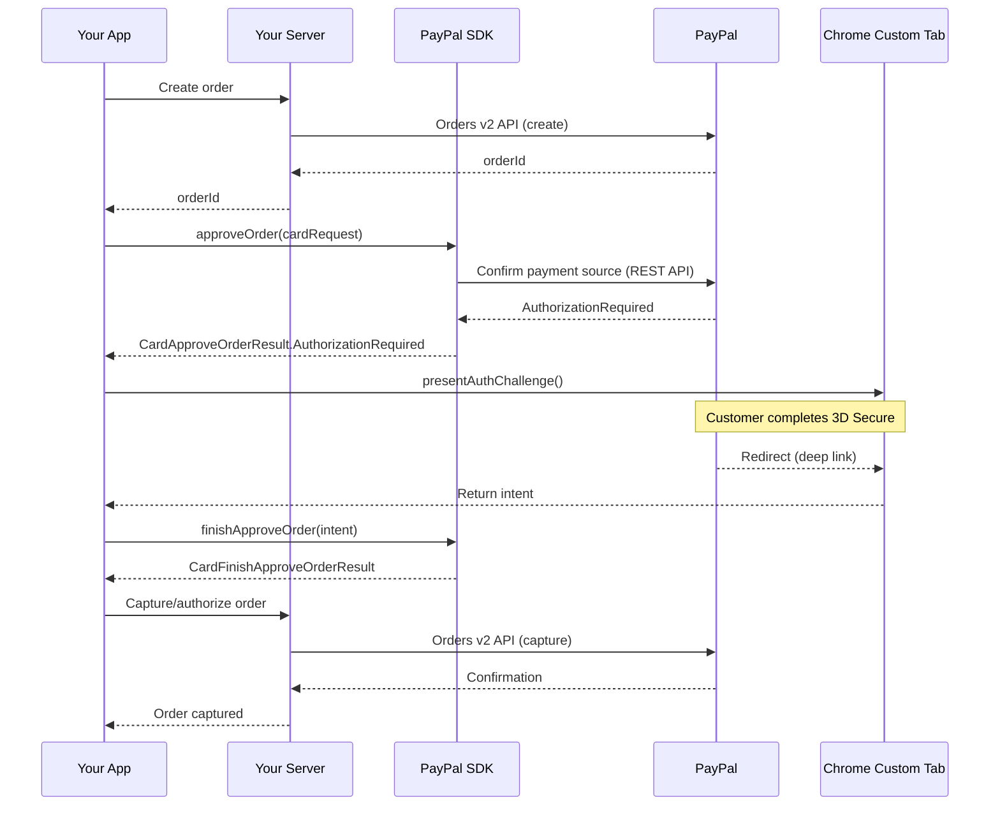
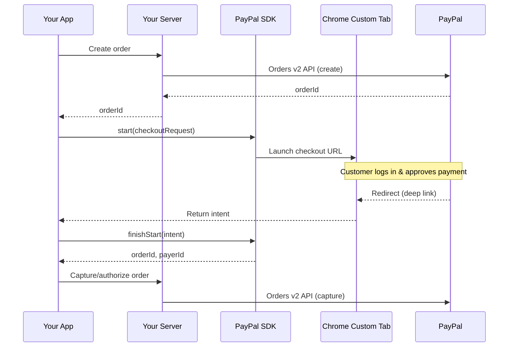
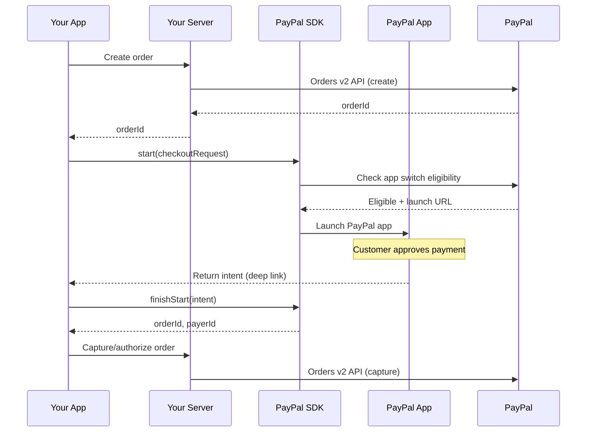

# PayPal Android SDK Integration Guide

## Overview

This guide shows you how to accept card payments and PayPal payments in your Android app using the PayPal Android SDK. You learn how to set up the SDK, process one-time payments, and vault payment methods for future use. Before you begin, review the [Prerequisites](#prerequisites) section to make sure your environment is ready.

**PayPal checkout flow (Chrome Custom Tab):**



**PayPal checkout flow (app switch):**



**Card payment flow:**



---

## How the PayPal Android SDK works

The SDK handles the client-side portion of your payment integration. For card payments, the SDK submits card data directly to PayPal using encrypted channels and returns a result your server uses to capture or authorize the order. For PayPal payments, the SDK launches a checkout experience where the customer logs in and approves the payment. When the customer finishes, PayPal redirects them back to your app using a deep link. Your server then captures or authorizes the approved order using the Orders v2 API.

### App switch vs. Chrome Custom Tab

The SDK supports two ways to present PayPal checkout:

- **App switch** — If the customer has the PayPal app installed and the merchant opts in with `appSwitchWhenEligible = true`, the SDK checks eligibility with PayPal's backend. If eligible, the SDK launches the PayPal app directly. This provides a native experience where the customer may already be logged in, reducing friction.
- **Chrome Custom Tab** — The default experience. The SDK opens a Chrome Custom Tab where the customer logs in to PayPal in a browser window.

When app switch is enabled, the SDK handles eligibility automatically. If the PayPal app is not installed, the eligibility check fails, or the backend determines the customer is not eligible, the SDK silently falls back to Chrome Custom Tab. No additional error handling is needed — the fallback is invisible to both the merchant and the customer.

The deep link return flow is identical regardless of which path the SDK takes. Your app calls the same `finishStart()` or `finishVault()` method and receives the same result types whether the customer returns from the PayPal app or from a Chrome Custom Tab.

---

## Prerequisites

Before you integrate the SDK, make sure you have the following:

- A PayPal developer account at [developer.paypal.com](https://developer.paypal.com)
- A sandbox client ID from the [PayPal Developer Dashboard](https://developer.paypal.com/api/rest/#link-getstarted)
- A server-side integration that can create PayPal orders and capture or authorize them (see [Orders v2 API](https://developer.paypal.com/docs/api/orders/v2/))
- For card vaulting or PayPal vaulting: a server that can create setup tokens and payment tokens (see [PayPal vaulting documentation](https://developer.paypal.com/docs/))
- Android Studio with a project targeting Android SDK 23 or higher
- Kotlin or Java project (the SDK is written in Kotlin but is fully callable from Java)
- If you haven't set up your server integration yet, see the [server-side setup guide](https://developer.paypal.com/docs/checkout/advanced/integrate/) before continuing

---

## Project setup

### Add SDK dependencies

Add the modules you need to your app-level `build.gradle` file. Use the current release version.

```groovy
dependencies {
    // Required: add at least one payment module

    // For card payments
    implementation 'com.paypal.android:card-payments:2.3.0'

    // For PayPal web checkout and PayPal vaulting
    implementation 'com.paypal.android:paypal-web-payments:2.3.0'

    // Optional: collect device data to help reduce fraud risk
    implementation 'com.paypal.android:fraud-protection:2.3.0'

    // Optional: PayPal payment button UI components
    implementation 'com.paypal.android:payment-buttons:2.3.0'
}
```

All modules are published to Maven Central under the `com.paypal.android` group.

**Snapshot builds**

To test upcoming features before they ship, use snapshot builds. First, add the snapshot repository to your top-level `build.gradle`:

```groovy
repositories {
    maven {
        url 'https://central.sonatype.com/repository/maven-snapshots/'
    }
}
```

Then reference the latest snapshot version:

```groovy
implementation 'com.paypal.android:card-payments:2.3.0-SNAPSHOT'
```

### Configure deep links

The SDK opens a Chrome Custom Tab or the PayPal app for certain flows (PayPal web checkout, PayPal vaulting, 3D Secure card authentication). When the customer finishes, PayPal redirects them back to your app using a deep link. You'll need to configure your app to receive this redirect.

The SDK uses `ReturnToAppStrategy` to determine how the customer returns to your app. Choose one of the two strategies:

**Option 1: Android App Links (HTTPS) — Recommended**

App Links use HTTPS URLs with domain verification (`android:autoVerify="true"`). This requires you to host a `/.well-known/assetlinks.json` file on your domain.

```xml
<activity
    android:name=".MainActivity"
    android:exported="true"
    android:launchMode="singleTop">

    <!-- Standard launcher intent-filter -->
    <intent-filter>
        <action android:name="android.intent.action.MAIN" />
        <category android:name="android.intent.category.LAUNCHER" />
    </intent-filter>

    <intent-filter android:autoVerify="true">
        <action android:name="android.intent.action.VIEW" />
        <category android:name="android.intent.category.DEFAULT" />
        <category android:name="android.intent.category.BROWSABLE" />
        <data
            android:host="your-app-domain.example.com"
            android:pathPrefix="/"
            android:scheme="https" />
    </intent-filter>
</activity>
```

Use this strategy in SDK requests:

```kotlin
val returnToAppStrategy = ReturnToAppStrategy.AppLink(
    appLinkUrl = "https://your-app-domain.example.com"
)
```

**Option 2: Custom URL Scheme**

Register a custom URL scheme in your `AndroidManifest.xml`. Your activity needs to use `android:launchMode="singleTop"` so that the OS delivers the return intent to the existing activity instance rather than creating a new one.

```xml
<activity
    android:name=".MainActivity"
    android:exported="true"
    android:launchMode="singleTop">

    <!-- Standard launcher intent-filter -->
    <intent-filter>
        <action android:name="android.intent.action.MAIN" />
        <category android:name="android.intent.category.LAUNCHER" />
    </intent-filter>

    <!-- Custom URL scheme for returning to app -->
    <intent-filter>
        <action android:name="android.intent.action.VIEW"/>
        <data android:scheme="com.example.myapp"/>
        <category android:name="android.intent.category.DEFAULT"/>
        <category android:name="android.intent.category.BROWSABLE"/>
    </intent-filter>
</activity>
```

Use this strategy in SDK requests:

```kotlin
val returnToAppStrategy = ReturnToAppStrategy.CustomUrlScheme(
    urlScheme = "com.example.myapp"
)
```

> **Architecture warning:** Only the activity that declares these intent-filters can receive deep links back into the host application. If your app has multiple activities, route all SDK flows through the activity that declares the deep link intent-filters.

---

## Initialize the SDK

Create a `CoreConfig` object with your client ID and environment. Then create a client for each payment method you need. The Demo app creates clients inside ViewModel constructors so they are scoped to the screen lifecycle.

```kotlin
// Create configuration (use Environment.LIVE for production)
val coreConfig = CoreConfig(
    clientId = "your-client-id",
    environment = Environment.SANDBOX
)

// Create the card payments client
val cardClient = CardClient(context, coreConfig)

// Create the PayPal web checkout / vault client
val paypalClient = PayPalWebCheckoutClient(context, coreConfig)

// Create the fraud protection data collector (optional)
val payPalDataCollector = PayPalDataCollector(coreConfig)
```

`CoreConfig` parameters:

| Parameter | Type | Required | Description |
|---|---|---|---|
| `clientId` | String | Yes | Your PayPal client ID from the Developer Dashboard |
| `environment` | Environment | No | `Environment.SANDBOX` (default) or `Environment.LIVE` |

---

## Process kill recovery

Android may stop your app process while the customer is in the external browser completing authentication. When the customer returns, Android launches a fresh process and delivers the deep link intent. If your SDK client objects were destroyed during the process stop, they have no auth state and cannot process the return.

The SDK provides `instanceState` and `restore()` on both `CardClient` and `PayPalWebCheckoutClient` to handle this case.

**Save state before leaving the app:**

```kotlin
// In your Activity, ViewModel, or wherever you manage SDK clients
val savedCardClientState = cardClient.instanceState
// Persist this string (for example, in SavedStateHandle or SharedPreferences)
savedStateHandle["card_client_state"] = savedCardClientState
```

**Restore state after process death:**

```kotlin
// When recreating your client
val cardClient = CardClient(context, coreConfig)
savedStateHandle.get<String>("card_client_state")?.let { savedState ->
    cardClient.restore(savedState)
}
```

The same `instanceState` / `restore()` pattern applies to `PayPalWebCheckoutClient`.

---

## Demo app architecture

The merchant-facing [Demo app](Demo/) included in the repository uses Jetpack Compose Navigation with a single entry-point activity. All SDK flows live within `MainActivity`, which contains a `NavHost`. Individual payment screens are composable destinations. Deep link returns arrive at `MainActivity` and are dispatched to the active screen.

This single-entry-point pattern is recommended because it avoids routing ambiguity: the OS delivers deep link intents to `MainActivity`, which is the only activity that declares the intent-filters for deep linking.

> **Note:** Your app's architecture may differ from the Demo app. The key requirement is that deep link intent-filters are declared on the activity that handles SDK return flows. The patterns shown in this guide are not prescriptive — adapt them to fit your app's architecture.

```kotlin
// MainActivity is the only activity; it uses launchMode="singleTop"
class MainActivity : ComponentActivity() {
    override fun onCreate(savedInstanceState: Bundle?) {
        super.onCreate(savedInstanceState)
        setContent {
            // NavHost contains all payment flow composables
            DemoApp()
        }
    }
}
```

---

## App switch eligibility

When you set `appSwitchWhenEligible = true` on a `PayPalWebCheckoutRequest` or `PayPalWebVaultRequest`, the SDK runs an eligibility check before launching checkout. This section explains how that check works and what happens at each step.

### How eligibility is determined



1. **Merchant opt-in** — The SDK checks whether the request has `appSwitchWhenEligible = true`. If `false` (the default), the SDK skips app switch entirely and uses Chrome Custom Tab.
2. **App installed check** — The SDK checks whether the PayPal app is installed on the device. If not, it falls back to Chrome Custom Tab without making a network call.
3. **Backend eligibility call** — The SDK sends a request to PayPal's backend with the order or setup token, the merchant's opt-in status, and device information. The backend evaluates eligibility based on factors such as merchant configuration, customer risk profile, and feature availability.
4. **Result** — If the backend returns `appSwitchEligible = true` with a launch URL, the SDK opens the PayPal app. If the backend returns `appSwitchEligible = false` (with an `ineligibleReason`), or if the API call fails, the SDK falls back to Chrome Custom Tab.

### Fallback guarantee

Every failure in the eligibility check results in a silent fallback to Chrome Custom Tab. The merchant does not need to handle these cases — the SDK manages them automatically. The customer sees a working checkout flow regardless of whether app switch is available.

### What the merchant controls

The only merchant-side control is the `appSwitchWhenEligible` flag. Setting it to `true` tells the SDK to attempt app switch when possible. The backend has final authority over eligibility. There is no way to force app switch — the flag is a request, not a guarantee.

---

## Accept a card payment

Use this flow when a customer pays with a credit or debit card. The flow has three steps: your server creates an order, the SDK approves the order with the card, and your server captures or authorizes the order.

**Without 3D Secure:**



**With 3D Secure:**



### What you'll do

Collect card details from the customer, call `cardClient.approveOrder()`, handle any 3D Secure challenge, then tell your server to capture or authorize the approved order.

### Server call

Your server creates a PayPal order and returns the order ID to your app. Call your server endpoint before starting the card flow. See the [Orders v2 API](https://developer.paypal.com/docs/api/orders/v2/) for the server-side implementation.

### SDK method call

```kotlin
// Build the Card object from customer input
val card = Card(
    number = "4111111111111111",          // customer's card number
    expirationMonth = "01",               // 2-digit month (MM)
    expirationYear = "2026",              // 4-digit year (YYYY)
    securityCode = "123",                 // CVV/CVC
    cardholderName = "Jane Doe",          // optional
    billingAddress = null                 // optional
)

// Build the request
// returnUrl must match a deep link registered in your AndroidManifest.xml
// Use your App Link URL or custom URL scheme (e.g., "com.example.myapp://")
val returnUrl = "https://your-app-domain.example.com"
val cardRequest = CardRequest(
    orderId = orderId,                    // order ID from your server
    card = card,
    returnUrl = returnUrl,
    sca = SCA.SCA_WHEN_REQUIRED           // default: only trigger 3D Secure when required
)

// Call approveOrder — result arrives asynchronously on the main thread
cardClient.approveOrder(cardRequest) { result ->
    when (result) {
        is CardApproveOrderResult.Success -> {
            // No 3D Secure challenge was needed; tell your server to capture/authorize
            captureOrderOnServer(result.orderId)
        }

        is CardApproveOrderResult.AuthorizationRequired -> {
            // 3D Secure challenge is required — present it in a Chrome Custom Tab
            when (val presentResult = cardClient.presentAuthChallenge(activity, result.authChallenge)) {
                is CardPresentAuthChallengeResult.Success -> {
                    // Do nothing here — wait for the deep link return
                    // (see "Deep Link Return" section below)
                }
                is CardPresentAuthChallengeResult.Failure ->
                    showError(presentResult.error.errorDescription)
            }
        }

        is CardApproveOrderResult.Failure ->
            showError(result.error.errorDescription)
    }
}
```

`SCA` options:

| Value | Behavior |
|---|---|
| `SCA.SCA_WHEN_REQUIRED` | Default. Only triggers 3D Secure authentication when PayPal requires it. |
| `SCA.SCA_ALWAYS` | Triggers 3D Secure authentication even when not required. |

### Handle the result

After `approveOrder` returns `Success`, tell your server to capture or authorize the order. Optionally collect device data to help reduce fraud risk before the server call.

```kotlin
// Optional: collect device data to help reduce fraud risk before capturing
val dataCollectorRequest = PayPalDataCollectorRequest(
    hasUserLocationConsent = false  // set to true only if user consented to location data
)
val clientMetadataId = payPalDataCollector.collectDeviceData(context, dataCollectorRequest)

// Tell your server to capture/authorize
// Pass clientMetadataId in the PayPal-Client-Metadata-Id header on your server request
yourServer.captureOrder(orderId, clientMetadataId)
```

### Deep link return

When 3D Secure authentication is required, the SDK opens a Chrome Custom Tab. After the customer completes authentication, PayPal redirects them back to your app using the `returnUrl` you provided.

Override `onResume()` and `onNewIntent()` in your activity to handle the return. Both are needed because Android can deliver the intent in two ways depending on whether the activity was in the foreground.

```kotlin
class MainActivity : ComponentActivity() {

    override fun onResume() {
        super.onResume()
        // Called when the activity returns to the foreground
        handleReturnIntent(intent)
    }

    override fun onNewIntent(intent: Intent) {
        super.onNewIntent(intent)
        // Called when a new intent arrives at the singleTop activity
        handleReturnIntent(intent)
    }

    private fun handleReturnIntent(intent: Intent) {
        cardClient.finishApproveOrder(intent)?.let { result ->
            // finishApproveOrder returns null if the intent is not for this auth session
            when (result) {
                is CardFinishApproveOrderResult.Success -> {
                    // Authentication succeeded; capture/authorize the order on your server
                    captureOrderOnServer(result.orderId)
                }

                is CardFinishApproveOrderResult.Failure ->
                    showError(result.error.errorDescription)

                CardFinishApproveOrderResult.Canceled ->
                    // Customer canceled 3D Secure; re-enable the pay button
                    resetToIdleState()

                CardFinishApproveOrderResult.NoResult -> {
                    // This intent was not for this auth session
                    // Re-enable the pay button so the customer can retry
                    resetToIdleState()
                }
            }
        }
    }
}
```

**Jetpack Compose alternative**

If your app uses Jetpack Compose, you can handle deep link returns with composable effects instead of Activity overrides. Place these two effects in the composable that manages your payment flow. Both are needed to cover the two ways Android can deliver the return intent.

```kotlin
@Composable
fun CardPaymentScreen(cardClient: CardClient) {
    val context = LocalContext.current
    val lifecycleOwner = LocalLifecycleOwner.current

    // Handle return when the activity resumes (e.g., returning from Chrome Custom Tab)
    val lifecycleState by lifecycleOwner.lifecycle.currentStateFlow.collectAsState()
    LaunchedEffect(lifecycleState) {
        if (lifecycleState == Lifecycle.State.RESUMED) {
            val activity = context as? ComponentActivity ?: return@LaunchedEffect
            activity.intent?.let { intent -> handleFinishApproveOrder(cardClient, intent) }
        }
    }

    // Handle return when a new intent is delivered to a singleTop activity
    DisposableEffect(Unit) {
        val activity = context as? ComponentActivity ?: return@DisposableEffect onDispose {}
        val listener = Consumer<Intent> { newIntent ->
            handleFinishApproveOrder(cardClient, newIntent)
        }
        activity.addOnNewIntentListener(listener)
        onDispose { activity.removeOnNewIntentListener(listener) }
    }

    // ... your payment UI
}

private fun handleFinishApproveOrder(cardClient: CardClient, intent: Intent) {
    cardClient.finishApproveOrder(intent)?.let { result ->
        when (result) {
            is CardFinishApproveOrderResult.Success ->
                captureOrderOnServer(result.orderId)
            is CardFinishApproveOrderResult.Failure ->
                showError(result.error.errorDescription)
            CardFinishApproveOrderResult.Canceled ->
                resetToIdleState()
            CardFinishApproveOrderResult.NoResult ->
                resetToIdleState()
        }
    }
}
```

> **Understanding `NoResult`:** `NoResult` means the SDK does not have enough information to determine the outcome — for example, if the customer returned to the app without completing authentication, or if the deep link intent was not associated with the current auth session. The payment may or may not have succeeded server-side. When you receive `NoResult`, query the [Orders v2 API](https://developer.paypal.com/docs/api/orders/v2/) from your server to check the current order status before showing an error or retrying.

### What's next

After capturing or authorizing the order on your server, show a confirmation to the customer. The card payment flow is complete.

---

## Vault a card

Vaulting stores a card as a reusable payment method. Use this flow when you want to charge a customer in the future without asking them to re-enter their card details.

The vault flow has three steps: your server creates a setup token, the SDK attaches the card to the setup token, and your server creates a payment token from the setup token.

### What you'll do

Collect card details, call `cardClient.vault()`, handle any 3D Secure challenge, then tell your server to create a payment token.

### Server call

Your server creates a setup token and returns the setup token ID. See the [PayPal vaulting documentation](https://developer.paypal.com/docs/) for the server-side implementation.

### SDK method call

```kotlin
val card = Card(
    number = "4111111111111111",
    expirationMonth = "01",
    expirationYear = "2026",
    securityCode = "123"
)

// returnUrl must match a deep link registered in your AndroidManifest.xml
val returnUrl = "https://your-app-domain.example.com"
val cardVaultRequest = CardVaultRequest(
    setupTokenId = setupTokenId,   // from your server
    card = card,
    returnUrl = returnUrl
)

cardClient.vault(cardVaultRequest) { result ->
    when (result) {
        is CardVaultResult.Success -> {
            // Card attached; tell your server to create a payment token
            createPaymentTokenOnServer(result.setupTokenId)
        }

        is CardVaultResult.AuthorizationRequired -> {
            // 3D Secure required — present challenge
            when (val presentResult = cardClient.presentAuthChallenge(activity, result.authChallenge)) {
                is CardPresentAuthChallengeResult.Success -> { /* wait for deep link return */ }
                is CardPresentAuthChallengeResult.Failure ->
                    showError(presentResult.error.errorDescription)
            }
        }

        is CardVaultResult.Failure ->
            showError(result.error.errorDescription)
    }
}
```

### Handle the result

After `vault` returns `Success`, tell your server to create a payment token from the setup token ID.

```kotlin
fun createPaymentToken(setupTokenId: String) {
    // Call your server to create a payment token
    // Your server calls the PayPal payment-tokens API
    yourServer.createPaymentToken(setupTokenId)
}
```

### Deep link return

Handle the deep link return using the same `onResume()` / `onNewIntent()` pattern used in the card payment flow (or the Jetpack Compose alternative). Call `finishVault()` instead of `finishApproveOrder()`.

```kotlin
private fun handleVaultReturnIntent(intent: Intent) {
    cardClient.finishVault(intent)?.let { result ->
        when (result) {
            is CardFinishVaultResult.Success -> {
                createPaymentTokenOnServer(result.setupTokenId)
            }

            is CardFinishVaultResult.Failure ->
                showError(result.error.errorDescription)

            CardFinishVaultResult.Canceled ->
                resetToIdleState()

            CardFinishVaultResult.NoResult ->
                resetToIdleState()
        }
    }
}
```

### What's next

After creating the payment token on your server, store the token ID. Use it for future charges without requiring the customer to re-enter card details.

---

## Accept a PayPal payment

Use this flow when a customer pays with their PayPal account. The SDK launches either the PayPal app (via app switch) or a Chrome Custom Tab for the customer to log in and approve the payment. See [App switch eligibility](#app-switch-eligibility) for how the SDK chooses between them.

**Chrome Custom Tab flow:**



**App switch flow:**



> **Note:** If app switch eligibility fails at any step, the SDK automatically falls back to the Chrome Custom Tab flow. Your code does not need to handle this — the same `start()` call covers both paths.

### What you'll do

Call `paypalClient.start()` with an order ID, then handle the deep link return to get the approval result.

### Server call

Your server creates a PayPal order and returns the order ID. See the [Orders v2 API](https://developer.paypal.com/docs/api/orders/v2/).

### SDK method call

```kotlin
val checkoutRequest = PayPalWebCheckoutRequest(
    orderId = orderId,                                           // from your server
    fundingSource = PayPalWebCheckoutFundingSource.PAYPAL,       // PAYPAL, PAYPAL_CREDIT, or PAY_LATER
    appSwitchWhenEligible = true,                                // switch to PayPal app if installed
    returnToAppStrategy = returnToAppStrategy                    // from Configure deep links section
)

paypalClient.start(activity, checkoutRequest) { startResult ->
    when (startResult) {
        is PayPalPresentAuthChallengeResult.Success -> {
            // Chrome Custom Tab or PayPal app opened
            // Do nothing here — wait for the deep link return
        }

        is PayPalPresentAuthChallengeResult.Failure ->
            showError(startResult.error.errorDescription)
    }
}
```

`PayPalWebCheckoutRequest` parameters:

| Parameter | Type | Required | Description |
|---|---|---|---|
| `orderId` | String | Yes | The order ID returned by your server after creating a PayPal order. |
| `fundingSource` | PayPalWebCheckoutFundingSource | No | The funding source for the checkout. Default: `PAYPAL`. |
| `appSwitchWhenEligible` | Boolean | No | Set to `true` to request app switch to the PayPal app when eligible. Default: `false`. This is a request, not a guarantee — the SDK checks eligibility and falls back to Chrome Custom Tab if app switch is not available. See [App switch eligibility](#app-switch-eligibility). |
| `returnToAppStrategy` | ReturnToAppStrategy | Yes | Determines how the customer returns to your app after checkout. See [Configure deep links](#configure-deep-links). |

`PayPalWebCheckoutFundingSource` options:

| Value | Description |
|---|---|
| `PAYPAL` | Standard PayPal checkout (default) |
| `PAYPAL_CREDIT` | PayPal Credit — revolving line of credit for eligible customers |
| `PAY_LATER` | Pay Later — short-term, interest-free payments for eligible customers |

### Handle the result

After the flow completes, capture or authorize the order on your server.

```kotlin
// After finishStart returns Success
fun capturePayPalOrder(orderId: String?) {
    if (orderId == null) {
        showError("Order ID is missing")
        return
    }
    yourServer.captureOrder(orderId)
}
```

### Deep link return

Override `onResume()` and `onNewIntent()` in your activity to handle the return (or use the Jetpack Compose alternative shown in the card payment section). Call `finishStart()` to complete the PayPal checkout flow.

> **App switch note:** The deep link return is handled identically whether the customer returns from the PayPal app or a Chrome Custom Tab. The same `finishStart()` call works for both paths, and you receive the same result types. No conditional logic is needed.

```kotlin
private fun handlePayPalReturnIntent(intent: Intent) {
    paypalClient.finishStart(intent)?.let { result ->
        // finishStart returns null if the intent is not for this auth session
        when (result) {
            is PayPalWebCheckoutFinishStartResult.Success -> {
                val orderId = result.orderId    // nullable — check before use
                val payerId = result.payerId    // nullable — check before use
                capturePayPalOrder(orderId)
            }

            is PayPalWebCheckoutFinishStartResult.Failure -> {
                showError(result.error.errorDescription)
            }

            is PayPalWebCheckoutFinishStartResult.Canceled -> {
                resetToIdleState()
            }

            PayPalWebCheckoutFinishStartResult.NoResult ->
                resetToIdleState()
        }
    }
}
```

### What's next

After capturing the order, show a payment confirmation to the customer. The PayPal checkout flow is complete.

---

## Vault a PayPal account

Vaulting a PayPal account stores it as a reusable payment method. Use this flow to save a customer's PayPal account for future payments.

App switch works the same way for vaulting as it does for checkout. Set `appSwitchWhenEligible = true` on the `PayPalWebVaultRequest` to enable it. The same eligibility check, silent fallback, and identical return flow apply. See [App switch eligibility](#app-switch-eligibility) for details.

### What you'll do

Call `paypalClient.vault()` with a setup token, then handle the deep link return.

### Server call

Your server creates a PayPal setup token and returns the setup token ID.

### SDK method call

```kotlin
val vaultRequest = PayPalWebVaultRequest(
    setupTokenId = setupTokenId,                                 // from your server
    appSwitchWhenEligible = true,                                // switch to PayPal app if installed
    returnToAppStrategy = returnToAppStrategy                    // from Configure deep links section
)

paypalClient.vault(activity, vaultRequest) { result ->
    when (result) {
        is PayPalPresentAuthChallengeResult.Success -> {
            // Browser opened; wait for deep link return
        }

        is PayPalPresentAuthChallengeResult.Failure ->
            showError(result.error.errorDescription)
    }
}
```

`PayPalWebVaultRequest` parameters:

| Parameter | Type | Required | Description |
|---|---|---|---|
| `setupTokenId` | String | Yes | The setup token ID returned by your server. |
| `appSwitchWhenEligible` | Boolean | No | Set to `true` to request app switch to the PayPal app when eligible. Default: `false`. Behavior is identical to checkout — see [App switch eligibility](#app-switch-eligibility). |
| `returnToAppStrategy` | ReturnToAppStrategy | Yes | Determines how the customer returns to your app after vaulting. See [Configure deep links](#configure-deep-links). |

### Handle the result

After vaulting succeeds, create a payment token on your server.

```kotlin
fun createPayPalPaymentToken(approvalSessionId: String) {
    yourServer.createPaymentToken(approvalSessionId)
}
```

### Deep link return

As with checkout, the return flow is the same whether the customer comes back from the PayPal app or a Chrome Custom Tab. Call `finishVault()` and handle the same result types.

```kotlin
private fun handlePayPalVaultReturnIntent(intent: Intent) {
    paypalClient.finishVault(intent)?.let { result ->
        when (result) {
            is PayPalWebCheckoutFinishVaultResult.Success ->
                createPayPalPaymentToken(result.approvalSessionId)

            is PayPalWebCheckoutFinishVaultResult.Failure ->
                showError(result.error.errorDescription)

            PayPalWebCheckoutFinishVaultResult.Canceled ->
                resetToIdleState()

            PayPalWebCheckoutFinishVaultResult.NoResult ->
                resetToIdleState()
        }
    }
}
```

### What's next

After creating the payment token on your server, store the token ID for future charges.

---

## Testing

Use the sandbox environment during development. Set `environment = Environment.SANDBOX` in your `CoreConfig`.

The [Demo app](Demo/) connects to a hosted sample server for testing purposes. Your integration connects to your own server, which calls the PayPal sandbox APIs.

**Test sandbox accounts**

Create sandbox test accounts in the [PayPal Developer Dashboard](https://developer.paypal.com) under your sandbox environment. Use these accounts when logging in during PayPal web checkout tests.

**Sandbox test card numbers**

| Card Number | Scenario |
|---|---|
| `4111111111111111` | Successful payment (Visa) |
| `5555555555554444` | Successful payment (Mastercard) |
| `4000000000003220` | 3D Secure authentication required |
| `4000000000000002` | Declined |

For the full list of sandbox test values, see the [PayPal sandbox testing guide](https://developer.paypal.com/tools/sandbox/card-testing/).

**Test scenarios to verify**

- Card payment succeeds without 3D Secure
- Card payment triggers 3D Secure challenge — customer completes authentication
- Card payment triggers 3D Secure challenge — customer cancels
- PayPal checkout completes via Chrome Custom Tab
- PayPal checkout — customer cancels in Chrome Custom Tab
- Process death recovery — stop the app while authentication is in progress, return to it, and verify the flow completes correctly

**Test app switch scenarios**

App switch requires a physical device with the PayPal app installed. Test the following:

- PayPal checkout with `appSwitchWhenEligible = true` and PayPal app installed — verify the PayPal app opens and the customer can approve the payment
- PayPal checkout with `appSwitchWhenEligible = true` and PayPal app **not** installed — verify the SDK falls back to Chrome Custom Tab without errors
- PayPal vault with `appSwitchWhenEligible = true` — verify the vault flow works through the PayPal app
- App switch return — verify that `finishStart()` / `finishVault()` returns the correct result when the customer returns from the PayPal app
- Eligibility fallback — if the backend determines the customer is not eligible for app switch, verify the SDK silently falls back to Chrome Custom Tab

> **Note:** App switch eligibility is determined by PayPal's backend and may not always be available in sandbox. If the PayPal app is installed but checkout still opens in a Chrome Custom Tab, the backend may have returned an ineligible result. This is expected behavior — the SDK is falling back correctly.

**Test process death recovery**

1. Start a checkout flow that opens a Chrome Custom Tab or the PayPal app (PayPal web checkout or card 3D Secure).
2. After the Chrome Custom Tab or PayPal app opens, use Android Studio's "Stop app" button to stop the process.
3. Return to the app by selecting the notification or using the back button from the browser or PayPal app.
4. Verify that your `restore()` call rebuilds the SDK client state and that `finishStart()` or `finishApproveOrder()` returns the correct result.

---

## Go live checklist

Before going live, complete the following:

- [ ] Replace `Environment.SANDBOX` with `Environment.LIVE` in your `CoreConfig`
- [ ] Replace your sandbox client ID with your live client ID
- [ ] Verify deep link configuration works in a release build (not just debug)
- [ ] If using App Links, confirm your `assetlinks.json` file is hosted and verified on your live domain
- [ ] Test process death recovery on a physical device running a live-like build
- [ ] Confirm that all result variants (`Success`, `Failure`, `Canceled`, `NoResult`) are handled in every callback
- [ ] Confirm that nullable return values (`status`, `orderId`, `payerId`) are null-checked before use
- [ ] If using app switch (`appSwitchWhenEligible = true`): test on a physical device with the PayPal app installed and verify the checkout completes through the PayPal app
- [ ] If using app switch: verify that checkout still works when the PayPal app is not installed (fallback to Chrome Custom Tab)
- [ ] If using app switch: verify the deep link return works correctly from the PayPal app in a release build
- [ ] Review Google Play policies regarding location data consent if you call `PayPalDataCollector` with `hasUserLocationConsent = true`

---

## Legal notices and compliance

### Fees and pricing

Merchant fees apply to PayPal transactions. See [paypal.com/fees](https://www.paypal.com/us/webapps/mpp/merchant-fees) for current pricing and applicable transaction fees in your region.

### Regional availability

PayPal payment processing is available in supported regions only. Features and funding sources described in this guide may not be available in all countries. To confirm availability in your region, see the [PayPal country and currency support documentation](https://developer.paypal.com/docs/reports/reference/paypal-supported-currencies/).

### Subject to change

The PayPal Android SDK, including all APIs, features, and behaviors described in this guide, is subject to change. Review the [PayPal Android SDK release notes](https://github.com/paypal/paypal-android/releases) and the [PayPal Developer Dashboard](https://developer.paypal.com) for the latest updates.

### Legal agreements

By integrating the PayPal Android SDK, you agree to the [PayPal User Agreement](https://www.paypal.com/us/legalhub/useragreement-full) and [PayPal Developer Agreement](https://www.paypal.com/us/legalhub/pp-developer-agreement). Review the [PayPal Privacy Statement](https://www.paypal.com/us/legalhub/privacy-full) for information on how PayPal handles user data.

---

## Related resources

- [PayPal Android SDK repository and Demo app](https://github.com/paypal/paypal-android)
- [PayPal developer documentation](https://developer.paypal.com/docs/checkout/advanced/android/)
- [Orders v2 API reference](https://developer.paypal.com/docs/api/orders/v2/)
- [PayPal Developer Dashboard](https://developer.paypal.com)
- [PayPal developer support](https://developer.paypal.com/docs/support/)
