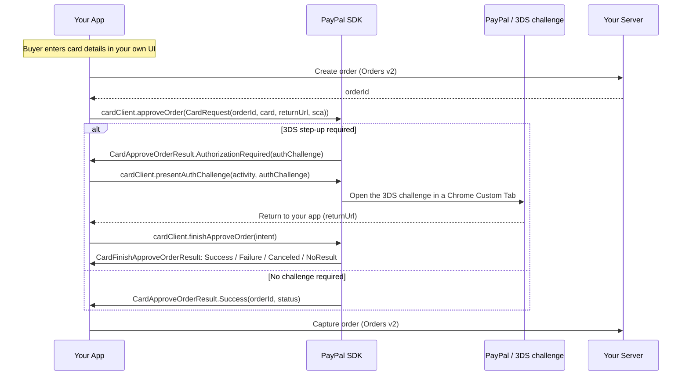

This guide shows you how to accept a **card payment** — Advanced Credit and Debit Card (ACDC) — in your Android app with PayPal Mobile SDK V3.0.0, including Vault (with or without a purchase). The SDK ships **no card-entry UI**: you build your own fields for card number, expiry, CVV, and optionally cardholder name and billing address, and you are responsible for input validation (Luhn check, brand detection, formatting). Card checkout uses its own client, `CardClient`, and passes everything in a single `CardRequest` — it does not use `createPayPalSession()`.

On Android, presenting the 3D Secure (3DS) challenge is **not** automatic: if PayPal requires a step-up, `approveOrder()` returns an `AuthorizationRequired` result carrying a challenge, and you explicitly call `presentAuthChallenge()`, then `finishApproveOrder(intent)` when the buyer returns.

> **Before you start:** complete [Install & Setup (Android)](android-install-and-setup.md). Card uses a custom-scheme return for the 3DS challenge only — reuse the `merchantapp` scheme you registered there (or register a dedicated one). Card does **not** require App Links.

## Overview



## Before you begin

Complete [Install & Setup (Android)](android-install-and-setup.md). For Card specifically:

* Add the `com.paypal.android:card-payments` module.
* Construct the client from the `CoreConfig` you built in setup:

```kotlin
val cardClient = CardClient(context, config)
```

* Have a return URL whose scheme is registered in your manifest (reuse `merchantapp://return` from setup). It is used only for the 3DS challenge return.

## Server: create an order

Call the Orders v2 API server-to-server and return **only the order ID** to your app.

```shell
curl -X POST https://api-m.sandbox.paypal.com/v2/checkout/orders \
  -H 'Content-Type: application/json' \
  -H 'Authorization: Bearer <access-token>' \
  -d '{ "intent": "CAPTURE", "purchase_units": [ { "amount": { "currency_code": "USD", "value": "49.99" } } ] }'
```

## Integrate Card

### Step 1: Collect the card and create the order

Build your own card-entry UI (the SDK provides no fields), then create the order on your server.

```kotlin
val card = Card(
    number = "4111111111111111",
    expirationMonth = "01",
    expirationYear = "2028",
    securityCode = "123",
    cardholderName = "Jane Smith",                 // optional
    billingAddress = Address(countryCode = "US")   // optional
)

val orderId = myServer.createOrder()
```

### Step 2: Approve the order

```kotlin
val request = CardRequest(
    orderId = orderId,
    card = card,
    returnUrl = "merchantapp://return",   // must match a registered intent-filter
    sca = SCA.SCA_WHEN_REQUIRED           // or SCA.SCA_ALWAYS to force a challenge every time
)

cardClient.approveOrder(request, object : CardApproveOrderCallback {
    override fun onCardApproveOrderResult(result: CardApproveOrderResult) {
        when (result) {
            is CardApproveOrderResult.Success -> captureOrder(result.orderId)
            is CardApproveOrderResult.AuthorizationRequired -> {
                when (val presentResult = cardClient.presentAuthChallenge(activity, result.authChallenge)) {
                    is CardPresentAuthChallengeResult.Success -> Unit  // challenge launched; resolve it in onNewIntent
                    is CardPresentAuthChallengeResult.Failure -> showError(presentResult.error)
                }
            }
            is CardApproveOrderResult.Failure -> showError(result.error)
        }
    }
})
```

### Step 3: Handle the 3DS challenge return

If a challenge was presented, forward the return intent to the SDK on foreground re-entry.

```kotlin
override fun onNewIntent(intent: Intent) {
    super.onNewIntent(intent)
    setIntent(intent)
    when (val result = cardClient.finishApproveOrder(intent)) {
        is CardFinishApproveOrderResult.Success  -> captureOrder(result.orderId)
        is CardFinishApproveOrderResult.Failure  -> showError(result.error)
        CardFinishApproveOrderResult.Canceled    -> showCheckoutScreen()
        CardFinishApproveOrderResult.NoResult    -> Unit  // unrelated intent; ignore
        null                                     -> Unit  // no challenge was in flight
    }
}
```

### Step 4: Capture the order

```kotlin
fun captureOrder(orderId: String) {
    // POST /v2/checkout/orders/{orderId}/capture on your server
    myServer.captureOrder(orderId)
}
```

**Surviving process death (optional).** If your activity may be recreated while a 3DS challenge is in flight, persist `cardClient.instanceState` before the process dies and call `cardClient.restore(instanceState)` on recreation, so `finishApproveOrder(intent)` can still resolve.

## Vault with Purchase

Save the card **while** completing a purchase, in one approval — the same `approveOrder()` sequence as above. The only difference is that your server creates the order with `payment_source.card.attributes.vault` set:

```shell
curl -X POST https://api-m.sandbox.paypal.com/v2/checkout/orders \
  -H 'Content-Type: application/json' \
  -H 'Authorization: Bearer <access-token>' \
  -d '{
    "intent": "CAPTURE",
    "purchase_units": [ { "amount": { "currency_code": "USD", "value": "49.99" } } ],
    "payment_source": { "card": { "attributes": { "vault": { "store_in_vault": "ON_SUCCESS" }, "customer": { "id": "<existing-or-new-customer-id>" } } } }
  }'
```

On approval the SDK result still only carries the order ID and status — **it does not return a payment token.** Retrieve the saved card's token server-side after capture.

## Vault without Purchase

Save a card with no purchase now. Follows the identical pattern against a setup token — `vault()` / `finishVault(intent)` mirror `approveOrder()` / `finishApproveOrder(intent)`.

```kotlin
val vaultRequest = CardVaultRequest(setupTokenId = setupTokenId, card = card, returnUrl = "merchantapp://return")

cardClient.vault(vaultRequest, object : CardVaultCallback {
    override fun onCardVaultResult(result: CardVaultResult) {
        when (result) {
            is CardVaultResult.Success -> savePaymentToken(result.setupTokenId)
            is CardVaultResult.AuthorizationRequired -> {
                when (val presentResult = cardClient.presentAuthChallenge(activity, result.authChallenge)) {
                    is CardPresentAuthChallengeResult.Success -> Unit  // challenge launched; resolve it in onNewIntent
                    is CardPresentAuthChallengeResult.Failure -> showError(presentResult.error)
                }
            }
            is CardVaultResult.Failure -> showError(result.error)
        }
    }
})

// In onNewIntent, resolve with: cardClient.finishVault(intent)
```

## Result handling

Card splits the result across three calls when a challenge is required: `approveOrder()` returns whether a challenge is needed; `presentAuthChallenge()` returns whether the challenge was successfully launched; `finishApproveOrder()` carries the outcome after the buyer returns. (Vault uses `CardVaultResult` / `finishVault()` with the same shape.)

| Type | Cases | What you do |
| --- | --- | --- |
| `CardApproveOrderResult` / `CardVaultResult` | `Success` / `AuthorizationRequired(authChallenge)` / `Failure(error)` | Success: capture (or store the token). AuthorizationRequired: call `presentAuthChallenge()`. Failure: show the error. |
| `CardPresentAuthChallengeResult` | `Success` / `Failure(error)` | Returned by `presentAuthChallenge()` itself. Success: the challenge was launched — wait for the buyer to return via `onNewIntent`. Failure: the challenge could not be launched; show the error instead of waiting for a return intent. |
| `CardFinishApproveOrderResult` / `CardFinishVaultResult` | `Success` / `Failure(error)` / `Canceled` / `NoResult` | Success: capture/store. Canceled: return to checkout. Failure: show the error. NoResult: the intent was not a card 3DS return — ignore it. |

> **Platform note:** Android opens whatever challenge URL comes back on the `payer-action` link. (iOS additionally validates that the challenge URL is a genuine PayPal 3DS page before opening it.)

## Testing and go-live

| Scenario | Expected result |
| --- | --- |
| **No challenge required** | `approveOrder()` returns `Success` directly — no Custom Tab opens. |
| **3DS challenge required** | `AuthorizationRequired` is returned; after `presentAuthChallenge()` and the buyer completes the challenge, `finishApproveOrder(intent)` returns `Success`. |
| Buyer cancels the 3DS challenge | `finishApproveOrder(intent)` returns `Canceled`; no charge is made. |
| `sca = SCA.SCA_ALWAYS` | Every approval attempts a challenge — useful for testing the challenge path on demand. |
| Vault with Purchase | Order captures; the saved card's token is retrievable server-side (not from the SDK result). |
| Process death during a challenge | With `instanceState` persisted and `restore()` called, `finishApproveOrder(intent)` still resolves. |

### Go live

- [ ] Validate card input in your own UI (Luhn, brand, formatting) — the SDK does not.
- [ ] Switch `Environment.SANDBOX` to `Environment.LIVE` and use your live client ID and merchant ID.
- [ ] Verify the 3DS return scheme (`returnUrl`) is registered and returns the buyer to your app.
- [ ] Confirm all result variants across `approveOrder()` and `finishApproveOrder()` are handled.
- [ ] Contact your PayPal account team to enable ACDC for production traffic.

## Related

* [Install & Setup (Android)](android-install-and-setup.md)
* [Troubleshooting (Android)](android-troubleshooting.md)
* [Orders v2 API](https://developer.paypal.com/docs/api/orders/v2/)
