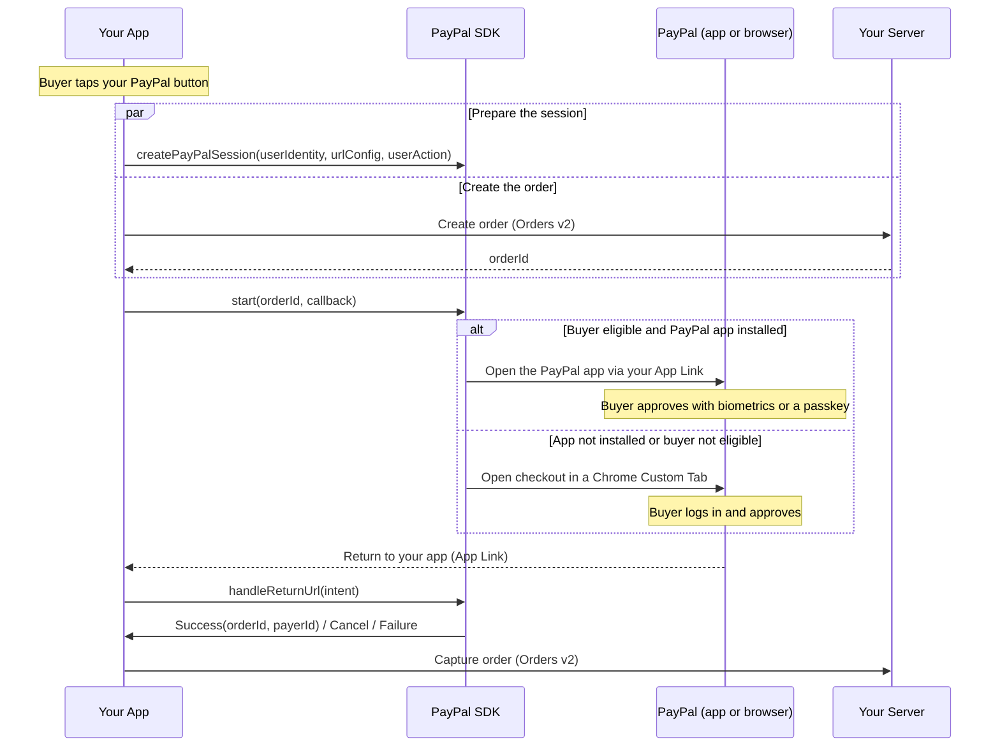

This guide shows you how to accept a **PayPal payment** in your Android app with PayPal Mobile SDK V3.0.0 — One-Time Checkout, Vault (with or without a purchase), and Pay Later / PayPal Credit. The **PayPal button** is the highlighted way to start checkout: when the buyer taps it, checkout happens in the PayPal app if they are eligible and have it installed — approving with biometrics or a passkey — then returns to your app through your Android App Link. If the PayPal app is not installed or the buyer is not eligible, checkout continues in a Chrome Custom Tab automatically.

> **Before you start:** complete [Install & Setup (Android)](android-install-and-setup.md). It covers the SDK dependency, `CoreConfig`, and return-link registration shared by every payment method.

## Overview

When the buyer taps your PayPal button, you call `createPayPalSession()` (with buyer identity, return URLs, and user action) and create the order — then call `start()` with just the order ID. `createPayPalSession()` is required and must come first.

**Prepare the session before checkout.** `start()` requires a prepared shopper session, created by `createPayPalSession()`. Until it has been called, `start()` will not proceed — it returns a `SESSION_NOT_STARTED` error on its callback. Preparing the session carries the buyer identity, return URLs, and user action to PayPal and determines whether checkout uses the PayPal app or the in-app browser.

**Create the session when the buyer shows intent.** Call `createPayPalSession()` from your PayPal button's `onClick` handler, ideally at the same time as you create the order, so its network latency overlaps order creation and it is ready by the time you call `start()`.



## How the SDK works

The SDK handles the client-side of checkout. It does not create or capture orders — your server does that with the Orders v2 API. Your responsibilities are: configure the client (see Install & Setup); in your `onClick` handler call `createPayPalSession()`, create the order, and pass its ID to `start()`; then forward the return intent to the SDK and capture. Choosing the experience (PayPal app vs. in-app browser) and returning the buyer are handled for you. The one ordering rule is that `createPayPalSession()` must be called before `start()`.

## Before you begin

Complete [Install & Setup (Android)](android-install-and-setup.md). For PayPal Checkout specifically:

* Add the `com.paypal.android:paypal-web-payments` and `com.paypal.android:payment-buttons` modules.
* Construct the client from the `CoreConfig` you built in setup:

```kotlin
val checkoutClient = PayPalWebClient(context, config)   // config + urlConfig from Install & Setup
```

## Server: create an order

Call the Orders v2 API server-to-server and return **only the order ID** to your app. Return and cancel URLs are passed to the SDK via the URL config (from Install & Setup), not in the Orders API body.

```shell
curl -X POST https://api-m.sandbox.paypal.com/v2/checkout/orders \
  -H 'Content-Type: application/json' \
  -H 'Authorization: Bearer <access-token>' \
  -d '{ "intent": "CAPTURE", "purchase_units": [ { "amount": { "currency_code": "USD", "value": "49.99" } } ] }'
```

## Integrate PayPal Checkout

### Step 1: Add the PayPal button

Render a `PayPalButton` on your checkout screen and set a click listener. It needs no order or session to display — declare it in your layout (or create it programmatically), then wire the tap:

```kotlin
payPalButton.setOnClickListener {
    beginCheckout()   // Steps 2-4
}
```

For the button's colors, labels, shapes, and sizes — and the Pay Later / PayPal Credit buttons — see [Payment Buttons (Android)](android-payment-buttons.md).

### Step 2: Create the PayPal session

Call this in the button's `onClick`, before or alongside order creation. It returns immediately and prepares the session in the background.

```kotlin
checkoutClient.createPayPalSession(
    userIdentity = PayPalUserIdentity.Email(email = "buyer@example.com", phone = null),  // or PayPalUserIdentity.None
    urlConfig    = urlConfig,
    userAction   = PayPalUserAction.CONTINUE   // PAY_NOW for a "Pay Now" button
)
```

### Step 3: Collect device data

Collect device data before you create the order, and attach the resulting client metadata ID to your create-order request so PayPal's risk systems can reduce declines.

```kotlin
val dataCollector = PayPalDataCollector(config)
val clientMetadataId = dataCollector.collectDeviceData(
    context, PayPalDataCollectorRequest(hasUserLocationConsent = false)
)
// Send clientMetadataId to your server; set it as the PayPal-Client-Metadata-Id header on your Orders v2 create call.
```

### Step 4: Create the order and start checkout

```kotlin
val orderId = myServer.createOrder()   // include the client metadata ID from Step 3

checkoutClient.start(
    orderId = orderId,
    callback = object : PayPalWebStartCallback {
        override fun onPayPalWebStartResult(result: PayPalWebCheckoutResult) {
            when (result) {
                is PayPalWebCheckoutResult.Success -> captureOrder(result.orderId)
                is PayPalWebCheckoutResult.Cancel  -> showCheckoutScreen()
                is PayPalWebCheckoutResult.Failure -> showError(result.error)   // includes SESSION_NOT_STARTED
            }
        }
    }
)
```

### Step 5: Handle the return

Forward the return intent to the SDK when your activity re-enters the foreground. The result is delivered through the callback you passed to `start()`.

```kotlin
override fun onNewIntent(intent: Intent) {
    super.onNewIntent(intent)
    setIntent(intent)
    checkoutClient.handleReturnUrl(intent)
}
```

### Step 6: Capture the order

```kotlin
fun captureOrder(orderId: String) {
    // POST /v2/checkout/orders/{orderId}/capture on your server
    myServer.captureOrder(orderId)
}
```

## Identity — PayPalUserIdentity

You pass `userIdentity` to `createPayPalSession()`. The hint helps PayPal recognize the buyer, which can increase app-switch eligibility and approval rates. The SDK hashes email and phone (SHA-256) before sending. It is required, but `None` is valid when you have no hint.

| Option | When to use |
| --- | --- |
| `PayPalUserIdentity.Email(email, phone)` | You know the buyer's email and/or phone. |
| `PayPalUserIdentity.ServerSideShopperSession(id)` | Your server already created a buyer session — pass its ID. |
| `PayPalUserIdentity.None` | You have no buyer hint. The session is still created. |

## Vault with Purchase

Vault with Purchase saves the buyer's PayPal account **while** completing a real purchase, in a single approval. There is no separate client call — use the exact same button → `createPayPalSession()` → `start(orderId, callback)` sequence above. The only difference is that your server creates the order with `payment_source.paypal.attributes.vault` set:

```shell
curl -X POST https://api-m.sandbox.paypal.com/v2/checkout/orders \
  -H 'Content-Type: application/json' \
  -H 'Authorization: Bearer <access-token>' \
  -d '{
    "intent": "CAPTURE",
    "purchase_units": [ { "amount": { "currency_code": "USD", "value": "49.99" } } ],
    "payment_source": { "paypal": { "attributes": { "vault": { "store_in_vault": "ON_SUCCESS", "usage_type": "MERCHANT", "customer_type": "CONSUMER" } } } }
  }'
```

On approval PayPal both completes the purchase and stores the payment method, but `PayPalWebCheckoutResult.Success` still only carries the order ID and payer ID — **the SDK does not return a payment token for this flow.** Retrieve the vaulted token server-side (GET the order, or via the Payment Method Tokens API) after capture.

## Vault without Purchase

Save a buyer's PayPal account for future charges with no purchase now. Call `createPayPalSession()` first (use `SETUP_NOW` for a "Set up now" button), then create the setup token on your server and call `vault()`.

```kotlin
// In your "Set up now" button's onClick handler:
checkoutClient.createPayPalSession(userIdentity, urlConfig, PayPalUserAction.SETUP_NOW)

val setupTokenId = myServer.createSetupToken()

checkoutClient.vault(
    setupTokenId = setupTokenId,
    callback = object : PayPalWebVaultCallback {
        override fun onPayPalWebVaultResult(result: PayPalWebVaultResult) {
            when (result) {
                is PayPalWebVaultResult.Success -> savePaymentToken(result.setupTokenId)
                is PayPalWebVaultResult.Cancel  -> showVaultScreen()
                is PayPalWebVaultResult.Failure -> showError(result.error)   // includes SESSION_NOT_STARTED
            }
        }
    }
)
```

## Pay Later and PayPal Credit

Pay Later and PayPal Credit are alternate PayPal funding sources on `PayPalWebCheckoutFundingSource` (`PAY_LATER` / `PAYPAL_CREDIT`; defaults to `PAYPAL`), not separate flows. Both are supported for One-Time Checkout and Vault with Purchase; neither applies to Vault without Purchase. Dedicated buttons exist — `PayLaterButton` and `PayPalCreditButton` (`payment-buttons` module) — see [Payment Buttons (Android)](android-payment-buttons.md).

> **Caveat:** funding-source selection is currently exposed only on the older, non-session `start(activity, request: PayPalWebCheckoutRequest, callback)` call (shown below). The session-based `start(orderId, callback)` flow above hardcodes the `PAYPAL` funding source and does not yet expose Pay Later / PayPal Credit selection.

```kotlin
val request = PayPalWebCheckoutRequest(orderId = orderId, fundingSource = PayPalWebCheckoutFundingSource.PAY_LATER)   // or .PAYPAL_CREDIT

checkoutClient.start(activity, request) { result ->
    when (result) {
        is PayPalWebCheckoutResult.Success -> captureOrder(result.orderId)
        is PayPalWebCheckoutResult.Cancel  -> showCheckoutScreen()
        is PayPalWebCheckoutResult.Failure -> showError(result.error)
    }
}
```

## Result handling

Checkout (including Vault with Purchase) delivers one of three outcomes via `PayPalWebCheckoutResult`; Vault without Purchase delivers the same shape via `PayPalWebVaultResult`. Handle all three — cancellation is a normal buyer choice, not an error.

| Outcome | How it is delivered | What you do |
| --- | --- | --- |
| **Success** | `...Result.Success` | Checkout / Vault with Purchase: capture the order. Vault without Purchase: store the returned setup token ID. |
| **Cancel** | `...Result.Cancel` | Return the buyer to your checkout (or save) screen; no charge was made. |
| **Failure** | `...Result.Failure` (error) | Show an error. `SESSION_NOT_STARTED` means `createPayPalSession()` was not called before `start()` / `vault()` — fix the ordering. |

## Best practices

**Show a loading indicator after the button tap.** Disable the button immediately after the buyer taps it, and show a loading indicator while `createPayPalSession()`, order creation, and `start()` are in flight. This prevents duplicate submissions.

**Provide buyer email and phone.** Pass both in `userIdentity` when you have them — together they improve app-switch eligibility, risk assessment, and approval rates beyond email alone.

**Handle the return to your app.** Remove the loading indicator as soon as your app returns to the foreground (`onNewIntent` / `onResume`). If the buyer backgrounded the PayPal app without approving or canceling, let them resume rather than restarting checkout.

**Handle redirection to the browser.** Occasionally the OS opens the return in a Chrome tab instead of your app — usually because the App Link is not verified. Your required `fallbackSchemeUrl` covers the common case; as a safeguard, consider website logic that detects a redirected buyer, confirms order status, and guides them back.

## Testing and go-live

Test on a **physical device** — the app-switch path does not work on an emulator.

### Trigger the app-switch path

The SDK switches to the PayPal app only when all of the following hold; otherwise it falls back to a Chrome Custom Tab:

* A physical device with the PayPal app installed (the sandbox app for sandbox testing).
* Merchant and buyer are in the US, and your integration is App Switch eligible.
* The buyer-identity email you pass to `createPayPalSession()` matches the account signed into the PayPal app.
* In the PayPal app, **Extend your login session** (and fingerprint) are enabled under **Avatar › Login and security**.

To test the in-app browser path, use a device without the PayPal app installed, or an ineligible buyer. Full sandbox-app setup lives in the published [PayPal Android testing guide](https://developer.paypal.com/braintree/docs/guides/paypal/testing-go-live/android/v5#testing-app-switch).

### Before you launch, test

| Scenario | Expected result |
| --- | --- |
| **App switch — end to end** | The buyer switches to the PayPal app, approves, returns to your app, and the order captures. |
| **In-app browser — end to end** | With the PayPal app not installed (or an ineligible buyer), checkout completes in a Chrome Custom Tab and the order captures. |
| Buyer cancels in PayPal | The buyer is returned to your checkout screen and no charge is made. |
| Vault with Purchase | Order captures; the vaulted token is retrievable server-side (not from the SDK result). |
| Vault without Purchase | You receive and store the setup token, and can charge it later. |
| Pay Later / PayPal Credit eligible buyer | Financing offers render; approval and capture proceed the same as standard PayPal. |

### Go live

- [ ] Call `createPayPalSession()` on the button tap, before or alongside order creation.
- [ ] Switch `Environment.SANDBOX` to `Environment.LIVE` and use your live client ID and merchant ID.
- [ ] Verify the App Link return works in a release build (assetlinks.json hosted and verified).
- [ ] Verify the custom-scheme fallback (`fallbackSchemeUrl`) is registered and returns the buyer to your app.
- [ ] Confirm all result variants (Success, Cancel, Failure) are handled.
- [ ] Collect device data and pass the client metadata ID on your Orders v2 request.
- [ ] Contact your PayPal account team to enable App Switch for production traffic.

## Related

* [Install & Setup (Android)](android-install-and-setup.md)
* [Payment Buttons (Android)](android-payment-buttons.md)
* [Troubleshooting (Android)](android-troubleshooting.md)
* [PayPal Developer Dashboard](https://developer.paypal.com/dashboard/)
* [Orders v2 API](https://developer.paypal.com/docs/api/orders/v2/)
