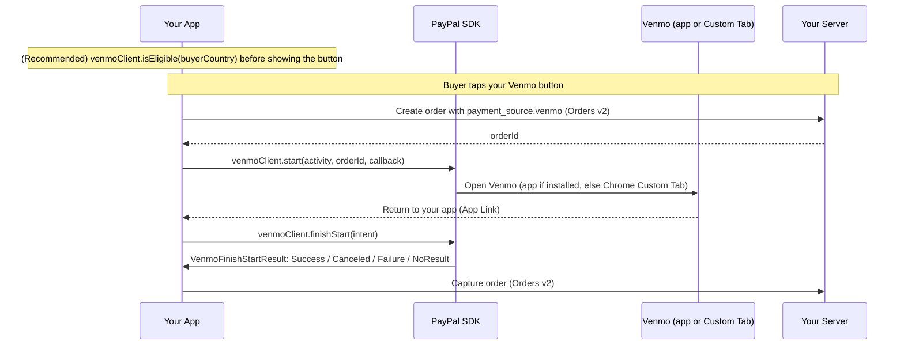

This guide shows you how to accept a **Venmo payment** (One-Time Checkout) in your Android app with PayPal Mobile SDK V3.0.0. Venmo checkout uses its own client, `VenmoClient`, and returns to your app via the same App Link you registered in Install & Setup. When the buyer taps your Venmo button, checkout opens the Venmo app if it is installed and the buyer is eligible; otherwise it falls back to a Chrome Custom Tab automatically. **Venmo supports One-Time Checkout only** — vault flows are not supported for Venmo.

> **Before you start:** complete [Install & Setup (Android)](../getting-started/android-install-and-setup.md).

## Overview

Unlike PayPal Checkout, Venmo does **not** use `createPayPalSession()`. Everything needed for the transaction is passed directly to `start()`. You check eligibility (recommended), start checkout against an order created with a Venmo payment source, then forward the return intent to the SDK.



## Before you begin

Complete [Install & Setup (Android)](../getting-started/android-install-and-setup.md). For Venmo specifically:

* Add the `com.paypal.android:venmo` module.
* Construct the client from the `CoreConfig` you built in setup:

```kotlin
val venmoClient = VenmoClient(context, config)
```

* Unlike PayPal Checkout, `VenmoClient` doesn't take a `ReturnToAppUrlConfig` or any URL config from the SDK — it never reads `fallbackSchemeUrl` or App Link settings from `CoreConfig`. The URL it opens to switch to Venmo is a fixed, SDK-built checkout URL with no merchant-configurable return path. The buyer's way back to your app instead comes from the `return_url` / `cancel_url` you set per-order, server-side (see below) — as long as those sit under the same host and path prefix as the App Link you registered in Install & Setup, Android's normal App Link routing delivers the buyer back to your activity, and `venmoClient.finishStart(intent)` reads the result straight off the returned URL's query parameters. There is currently no custom-scheme fallback for Venmo — if the App Link isn't verified, there's no documented fallback path back to your app.

## Server: create the order with the Venmo payment source

Call the Orders v2 API server-to-server with a **Venmo** payment source. `app_switch_context.source: "NATIVE_APP"` tells Venmo the order originated from a native app-switch flow. Return only the order ID to your app.

```shell
curl -X POST https://api-m.sandbox.paypal.com/v2/checkout/orders \
  -H 'Content-Type: application/json' \
  -H 'Authorization: Bearer <access-token>' \
  -d '{
    "intent": "CAPTURE",
    "purchase_units": [ { "amount": { "currency_code": "USD", "value": "49.99" } } ],
    "payment_source": { "venmo": { "experience_context": {
      "return_url": "https://example.com/merchant-app/return",
      "cancel_url": "https://example.com/merchant-app/cancel",
      "app_switch_context": { "source": "NATIVE_APP" }
    } } }
  }'
```

## Integrate Venmo

### Step 1: Check eligibility (recommended)

Gate your Venmo button on eligibility so it only shows when Venmo can be used.

```kotlin
venmoClient.isEligible(
    buyerCountry = "US",
    callback = { result ->
        when (result) {
            is VenmoEligibilityResult.Eligible   -> showVenmoButton()
            is VenmoEligibilityResult.Ineligible -> hideVenmoButton()  // result.reason
            is VenmoEligibilityResult.Error      -> hideVenmoButton()  // result.error
        }
    }
)
```

### Step 2: Start Venmo checkout

On the button tap, create the order (with the Venmo payment source above) and call `start()`.

```kotlin
val orderId = myServer.createOrder()   // created with the Venmo payment source

venmoClient.start(
    activity = this,
    orderId = orderId,
    callback = { result ->
        when (result) {
            is VenmoStartResult.Success -> { /* app switch / Custom Tab launched; awaiting the return */ }
            is VenmoStartResult.Failure -> showError(result.error)
        }
    }
)
```

### Step 3: Handle the return intent

Forward the return intent to the SDK when your activity re-enters the foreground.

```kotlin
override fun onNewIntent(intent: Intent) {
    super.onNewIntent(intent)
    setIntent(intent)
    when (val result = venmoClient.finishStart(intent)) {
        is VenmoFinishStartResult.Success  -> captureOrder(result.token)   // result.payerId, result.approved also available
        is VenmoFinishStartResult.Canceled -> showCheckoutScreen()         // result.orderId also available, if present
        is VenmoFinishStartResult.Failure  -> showError(result.error)
        is VenmoFinishStartResult.NoResult -> Unit                         // unrelated intent; ignore
    }
}
```

### Step 4: Capture the order

```kotlin
fun captureOrder(orderId: String) {
    // POST /v2/checkout/orders/{orderId}/capture on your server
    myServer.captureOrder(orderId)
}
```

## Result handling

Venmo splits the result across two calls: `VenmoStartResult` tells you whether the app switch / Custom Tab launched; `VenmoFinishStartResult` carries the actual outcome once the buyer returns.

| Type | Cases | What you do |
| --- | --- | --- |
| `VenmoStartResult` | `Success` / `Failure(error)` | Confirms the switch/Custom Tab opened. A failure here means checkout never launched — show the error. |
| `VenmoFinishStartResult` | `Success(token, payerId, approved)` / `Canceled(orderId)` / `Failure(error)` / `NoResult` | Success: capture the order; `approved` reflects whether the buyer approved the payment. Canceled: return to your checkout screen — `orderId` is included when available. Failure: show the error. NoResult: the intent was not a Venmo return — ignore it. |

## Testing and go-live

Follow the same physical-device approach as PayPal App Switch, with two differences: sign in to the sandbox app with a **Venmo** (not just PayPal) test account, and create the order with the Venmo payment source shown above.

| Scenario | Expected result |
| --- | --- |
| **App switch — end to end** | With the Venmo app installed and eligible, the buyer switches to Venmo, approves, returns to your app, and the order captures. |
| **Custom Tab fallback — end to end** | With the Venmo app not installed, checkout completes in a Chrome Custom Tab and the order captures. |
| Buyer cancels in Venmo | `finishStart` returns `Canceled`; no charge is made. |
| Eligibility gates the button | For an ineligible buyer/country, `isEligible()` returns `Ineligible` and your Venmo button stays hidden. |

### Go live

- [ ] Confirm the `com.paypal.android:venmo` module is included in your SDK dependency.
- [ ] Gate the Venmo button on `isEligible()`.
- [ ] Switch `CoreEnvironment.SANDBOX` to `CoreEnvironment.LIVE` and use your live client ID and merchant ID.
- [ ] Verify the App Link return works in a release build; confirm your order's `return_url`/`cancel_url` share the same host and path prefix as that App Link.
- [ ] Confirm all `VenmoFinishStartResult` cases (Success, Canceled, Failure, NoResult) are handled.
- [ ] Contact your PayPal account team to enable Venmo for production traffic.

## Related

* [Install & Setup (Android)](../getting-started/android-install-and-setup.md)
* [Troubleshooting (Android)](android-troubleshooting.md)
* [Orders v2 API](https://developer.paypal.com/docs/api/orders/v2/)
