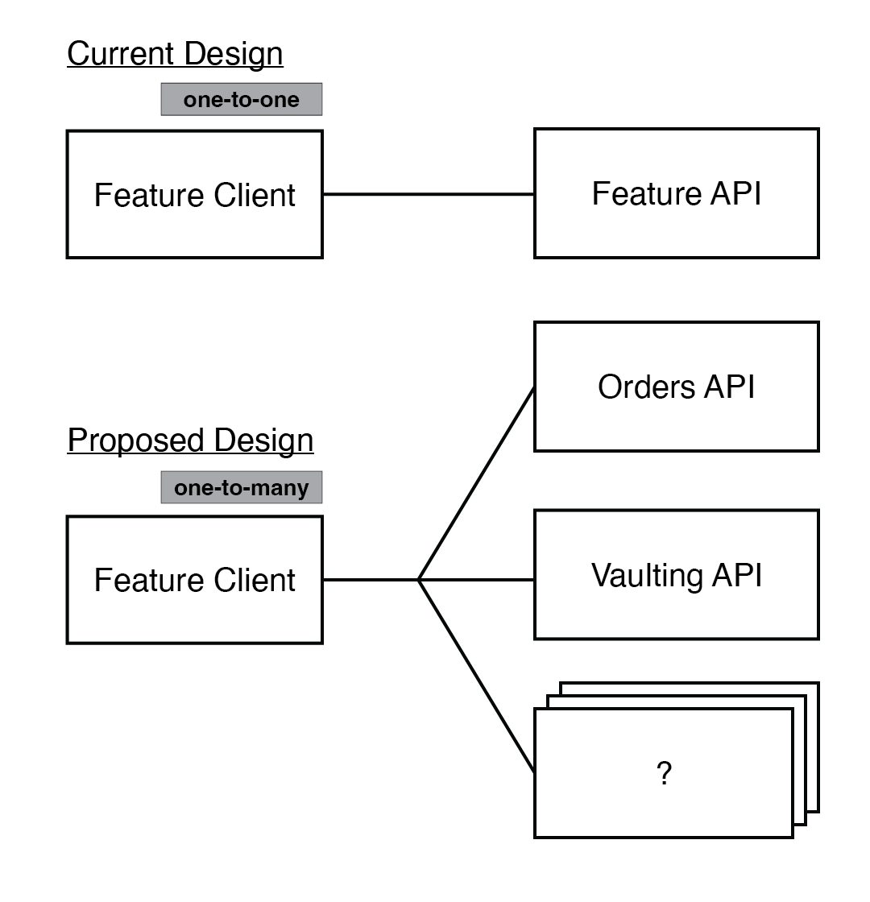
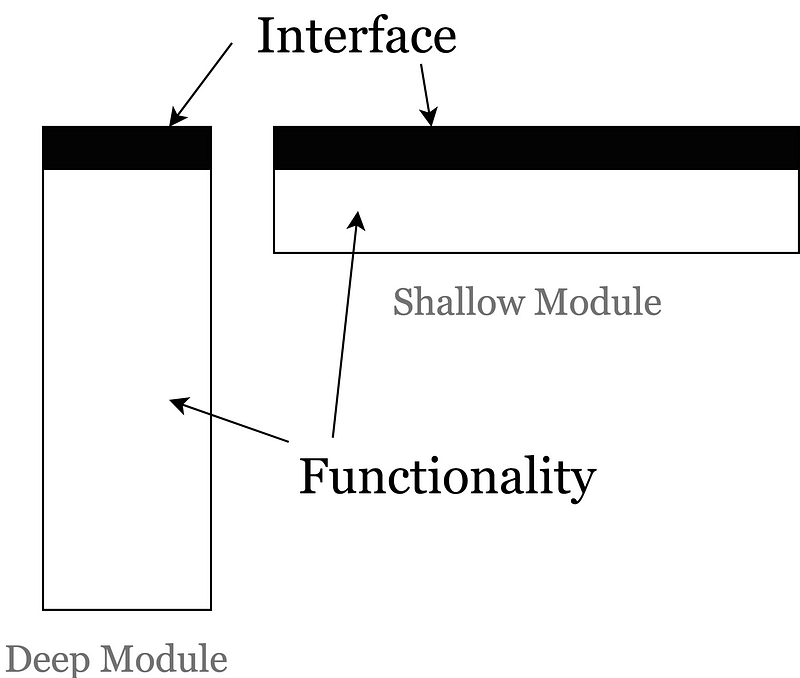

# Dissolve Core API and HTTP Request Factories

**Status: Proposed**

## Context

The PayPal SDK for Android currently has a layered architecture. Merchant applications interact with the surface of our SDK through Feature Clients. Each Feature Client transforms a merchant request into an API call that is then delegated to an underlying API layer.

By convention, every `<FEATURE_NAME>Client` instance has a corresponding `<FEATURE_NAME>API` dependency. Each API component is responsible for encapsulating low-level networking and multi-threading logic so that Feature Clients can focus primarily on high-level business logic.

The current architecture also encapsulates core API functionality in an `API` class, similar to how `BraintreeClient` in the Braintree Android SDK allows access to the following behavior through composition:

- Load Merchant Configuration
- Initiate a Browser Switch
- Send HTTP Requests
- Send GraphQL Requests
- Send Analytics

This works well for the Braintree SDK–a shared resource for common Braintree API calls correlates nicely with the monolithic nature of the Braintree gateway's API. On the other hand, the PayPal SDK works by combining a set of microservice APIs to offer each payment method as a standalone feature. With a microservice architecture, it becomes difficult for us to identify "core" functionality.

## Decision

While the PayPal SDK doesn't have a core client, it does have a core `API` class that is similar to `BraintreeClient`. In the PayPal SDK, each feature client has an associated API class used to execute requests over the network to a given web service.

The API pattern is a great way to shield feature clients from the complexities of making a network request, similar to how `BraintreeClient` `sendPost()` and `sendGraphQL` post do in the Braintree SDK. It allows feature clients to focus on business logic and success (or failure) tracking with Analytics.

Currently our naming convention and division of responsibility is build on a one-to-one relationship between `<FEATURE_NAME>Client` and `<FEATURE_NAME>API`. While in most cases this does result in a positive feature client implementation because, as mentioned before, there is no low-level networking code in the feature client, the set of behavior offered by each API component is arbitrary. The API components in our architecture currently do not map to a known real world entity. Feature clients may rely on multiple PayPal web services, and if multiple features rely on the same microservices, we run the risk of introducing duplication within the codebase.

A more scalable solution would be to offer feature clients a one-to-many relationship with API components. We can map each API class to its own corresponding microservice. API networking code can then be shared among different features. It will then become clear what the responsibility of each API class is, which is good for DRYness, Single Responsibility Principle, and tesability.

> 

> 

We also have an opportunity to implement each API component as a [Deep Module][1]. We created `HttpRequestFactory` as a temporary concept because it provided a highly testable interface for asserting `APIRequest` JSON bodies. Since API classes will have a single responsibility to execute API requests internally, we can simplify our design by making this a responsibility of the API class. Response parsing can also be done internally.

> 

## Consequences

Composing each API within a feature client does lead to an increased parameter count when constructing feature clients. This is unsightly for the most part. The number of dependencies for a given feature client will correspond directly to the number of APIs a given feature client interacts with.

[1]: https://nakabonne.dev/posts/depth-of-module/
