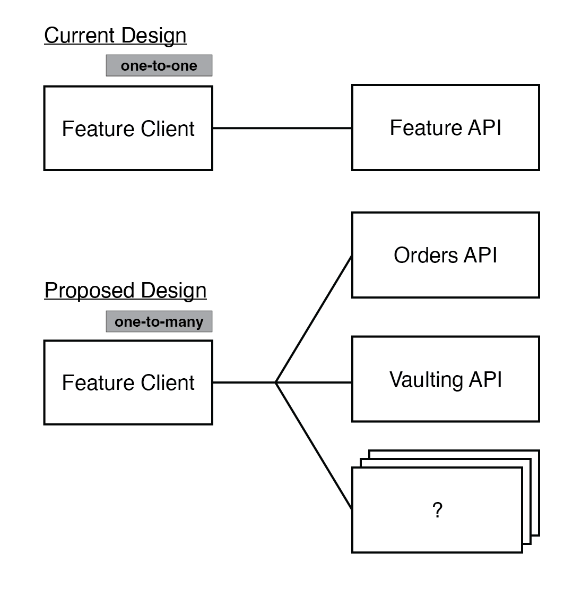

# Remove Core API and HTTP Request Factories

**Status: Approved**

## Context

The PayPal SDK for Android currently has a layered architecture. Merchant applications interact with the surface of our SDK through Feature Clients. Each Feature Client transforms a merchant request into an API call that is then delegated to an underlying API layer.

By convention, every `<FEATURE_NAME>Client` instance has a corresponding `<FEATURE_NAME>API` dependency. Each API component is responsible for encapsulating low-level networking and multi-threading logic so that Feature Clients can focus primarily on high-level business logic.

The current architecture encapsulates core API functionality in an `API` class, similar to how `BraintreeClient` in the Braintree SDK for Android allows access to the following behavior through composition:

- Load Merchant Configuration
- Initiate a Browser Switch
- Send HTTP Requests
- Send GraphQL Requests
- Send Analytics

This works well for the Braintree SDK–a shared resource for common Braintree API calls correlates nicely with the monolithic nature of the Braintree gateway's API. On the other hand, the PayPal SDK works by combining a set of microservice APIs to offer each payment method as a standalone feature. With a microservice architecture, it becomes difficult for us to identify "core" functionality.

## Decision

We should remove the core `API` component and refactor each `<FEATURE_NAME>API` component into individual `<SERVICE_NAME>API` components for each microservice used by the SDK. 

> 

We can restrict API components to not depend on other API components to maximize API call composition within feature clients. We are also preserving part of the existing architecture by encapsulating complexity when it makes sense to allow Feature Clients to efficiently execute business logic. In some cases, it may make sense to create an intermediary "Utility" layer to allow for the composition of platform specific behavior within Feature Clients:

> 

As seen in the figure above, an `AnalyticsService` can be helpful to abstract away the delivery of event tracking from FeatureClients. A `ClientIdRepository` may also be helpful to efficiently fetch a Client Id that is associated with a given access token.

### Also: Remove HTTP Request Factories

The current design also resulted in the creation of [HttpRequestFactory][2] objects through TDD. These objects make testing `HttpRequest` objects easier, but they exist mostly because of the one-to-one relationship between Feature Clients and their API component.

We should remove http request factories as well and implement each `API` class as a [Deep Module][1]:

> 

The idea is to create API components with simple interfaces and powerful functionality. The API components will also be easy to test since its the only component where we have to verify the path of the HTTP request, the HTTP method used to make the request, and the HTTP body of the request when making an API call.

## Consequences

Feature Clients will have a dependency on each microservice they use. A side effect of a Feature Client having a lot of dependencies is an increased parameter count for the client's constructor. This could result in:

1. Decreased readability
1. Linting errors
1. A decrease in code coverage until we pick a suitable dependency injection framework

[1]: https://nakabonne.dev/posts/depth-of-module/
[2]: https://github.com/paypal/paypal-android/blob/da0f20c22b0c958f6f5b97a78e4d0814484d5ff2/CorePayments/src/main/java/com/paypal/android/corepayments/HttpRequestFactory.kt#L7

